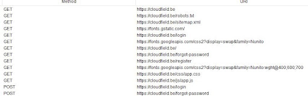
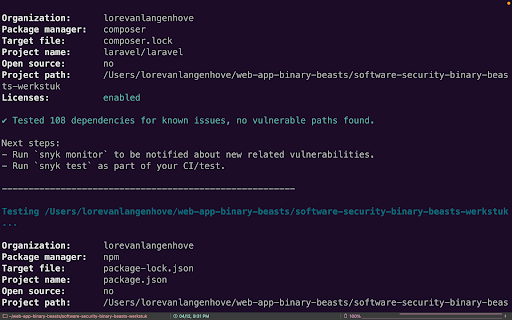

# Feedback

- [Gebruikte tools](#Gebruikte-tools)
- [Legende](#Legende)
- [Testen](#Testen)
  - [Acceptance criteria](#Acceptance-criteria)
  - [HTTPS](#HTTPS)
  - [Aanmelden](#Aanmelden)
  - [Wachtwoorden](#Wachtwoorden)
  - [Web vulnerabilities](#Web-vulnerabilities)
  - [REST API](#REST-API)
- [Threat Model](#Threat-Model)
  - [DOS / DDOS Attack](#DOS-/-DDOS-Attack)
  - [Overig](#Overig)
- [Aanbevelingen](#Aanbevelingen)
- [Bijlages](#Bijlages) -[OWASP ZAP](#OWASP-ZAP)
  - [Samgrep](#Samgrep)
  - [Gitleaks](#Gitleaks)
  - [Snyk](#Snyk)

## Gebruikte tools

We hebben deze tools gebruikt om te testen uit te voeren:

- OWASP ZAP
- Semgrep
- Gitleaks
- Dependabot
- Snyk
- Npm audit
- Observatory van mozilla
- Redbot
- Urlscan
- DNS check
- 2GDPR
- UpGuard
- Quttera
- Pentest tools
- Sucuri
- Detectify
- Probely

## Legende:

| Symbool | Betekenis     |
| :-----: | ------------- |
|   ❌    | Niet geslaagd |
|   ✅    | Geslaagd      |
|   ---   | ---           |
|   🔴    | Critical      |
|   🟡    | High          |
|   🔵    | Medium        |
|   🟢    | Low           |

## Testen

### Acceptance criteria

| Passed | Criteria                                                                              | Notes                                | Severity |
| :----: | ------------------------------------------------------------------------------------- | ------------------------------------ | :------: |
|   ❌   | As as teacher I can sign up using my EhB e-mailaddress                                | We krijgen geen bevestigingsmail toe |    🔴    |
|   ❌   | As as student I can sign up using my EhB e-mailaddress                                | Zelfde als bij teacher               |    🔴    |
|   ✅   | As a teacher or student I can login/logout                                            |                                      |          |
|   ✅   | As a teacher I can create/view/edit/delete groups                                     |                                      |          |
|   ✅   | As a teacher I can view all students                                                  |                                      |          |
|   ✅   | As a teacher I can (un)assign students to groups                                      |                                      |          |
|   ✅   | As a student or teacher I can create/delete an event                                  |                                      |          |
|   ✅   | As a student or teacher I can create/delete an event private to a specific group      |                                      |          |
|   ✅   | As a student or teacher I can view a list of all events                               |                                      |          |
|   ✅   | As a student I can view a list of all events in my group                              |                                      |          |
|   ✅   | As a student or teacher I can view the details of an event                            |                                      |          |
|   ✅   | As a student or teacher I can see all attendees of an event if I have rights to do so |                                      |          |
|   ✅   | As a student or teacher I can indicate if I will be attending an event                |                                      |          |
|   ✅   | As an admin I can assign roles to other users (Student, Teacher, Admin)               |                                      |          |

#### Conclusie

Alle acceptance criteria zijn voldaan, behalve het zich kunnen inloggen met een EhB e-mailadres voor zowel student als teacher. De user krijgt geen bevestigingsmail waardoor hij zich niet kan verifiëren en geen toegang heeft op de website.

### HTTPS

| Passed | Criteria                                                                                                                                                                                                                                                                                                                                                                   | Notes                   | Severity |
| :----: | -------------------------------------------------------------------------------------------------------------------------------------------------------------------------------------------------------------------------------------------------------------------------------------------------------------------------------------------------------------------------- | ----------------------- | -------- |
|   ✅   | Alle publiek bereikbare onderdelen van je web toepassing mogen enkel over HTTPS beschikbaar zijn. Dit behelst dus niet enkel web pagina's en ondersteunend materiaal zoals CSS of JavaScript bestanden, maar ook publieke APIs. Deze vereiste is zo belangrijk voor de veiligheid dat oplossingen die hier niet aan voldoen een nul-score krijgen voor de demo opdrachten. |                         |          |
|   ✅   | Server X.509 certificaten vormen deel van een certificate chain waarvan de root voorkomt in de standaard trust store van mainstream browsers, zoals Firefox, Chrome of Safari, of beheerssystemen, zoals Windows, macOS of Linux.                                                                                                                                          |                         |          |
|   ✅   | Je domein of domeinen krijgen minstens een A score bij de [SSL Labs server test](https://www.ssllabs.com/ssltest/analyze.html?d=cloudfield.be).                                                                                                                                                                                                                            |                         |          |
|   ✅   | Iedere respons bevat een Strict-Transport-Security header.                                                                                                                                                                                                                                                                                                                 |                         |          |
|   ✅   | Je domein of domeinen staan in de [HSTS preload list](https://hstspreload.org/?domain=cloudfield.be) of wachten op toevoeging.                                                                                                                                                                                                                                             | Still pending           |          |
|   ✅   | Er zijn CAA DNS Resource Records voor je domein of domeinen.                                                                                                                                                                                                                                                                                                               | Issues by Amazonaws.com |          |

#### Conclusie

Er wordt aan alle HTTPS-criteria voldaan. Het domein wacht nog op toevoeging in de HSTS preload list en er waren problemen bij amazonaws voor de CAA DNS Resource Records. Het publieke IP adres is publiek beschikbaar, eens er naar deze IP wordt gesurft, geeft de browser aan dat deze site unsecure is.

### Aanmelden

| Passed | Criteria                                                                                                                                                                                                                                                                            | Notes                                                                                                                     | Severity |
| :----: | ----------------------------------------------------------------------------------------------------------------------------------------------------------------------------------------------------------------------------------------------------------------------------------- | ------------------------------------------------------------------------------------------------------------------------- | :------: |
|   ✅   | Een gebruiker moet zich kunnen aanmelden.                                                                                                                                                                                                                                           |                                                                                                                           |          |
|   ✅   | Een gebruiker moet zich kunnen afmelden.                                                                                                                                                                                                                                            |                                                                                                                           |          |
|   ✅   | De applicatie geeft ten alle tijde duidelijk aan of de gebruiker al dan niet aangemeld is.                                                                                                                                                                                          | Je moet sowieso ingelogd zijn om de website te bekijken + naam van ingelogde gebruiker komt tevoorschijn                  |          |
|   ❌   | Na aanmelden kan de gebruiker zijn of haar gegevens opvragen.                                                                                                                                                                                                                       | Kan niet zien welke rol je hebt, maar user heeft wel eigen profile-page, ook niet mogelijk om user gegevens te downloaden |    🟡    |
|   ✅   | Een gebruiker mag zich pas kunnen aanmelden als hij of zij controle over een email adres opgegeven tijdens registratie heeft aangetoond. Na het versturen van een registratieformulier krijgt de gebruiker melding dat instructies in de bevestigingsemail moeten worden opgevolgd. | Maar de mail wordt niet onvangen op een ehb-email address                                                                 |          |

#### Conclusie

Enkel het opvragen van de gegevens van de user nadat deze zich heeft aangemeld, is niet volledig geslaagd. De user heeft wel een eigen profielpagina waarop zijn username en e-mail staat, maar hij kan niet raadplegen welke rol hij heeft. De laatste criteria werkt enkel niet voor EhB e-mailadressen.

### Wachtwoorden

| Passed | Criteria                                                                                                                                                                                                               | Notes                                                                          | Severity |
| :----: | ---------------------------------------------------------------------------------------------------------------------------------------------------------------------------------------------------------------------- | ------------------------------------------------------------------------------ | :------: |
|        | Bij registratie dient de gebruiker:                                                                                                                                                                                    |                                                                                |          |
|   ✅   | <li>Te kunnen kopiëren uit een password manager en in een password veld van de registratiepagina plakken.</li>                                                                                                         |                                                                                |          |
|   ✅   | <li>Verplicht te worden een wachtwoord te kiezen van minstens 8 karakters.</li>                                                                                                                                        |                                                                                |          |
|   ✅   | <li>Een zeer lang wachtwoord te kunnen kiezen met lengte minstens 64 karakters.</li>                                                                                                                                   | getest met "A7B19F5F220810526E289BB717D07CA684102B5DA043325E7D0477D549FC356A"  |          |
|   ✅   | <li>Elk 'printable' ASCII karakter te kunnen opnemen in het wachtwoord.</li>                                                                                                                                           | getest met "8-{e\!L,.j)ssXAkx(!K\'pT%)(Er\=ATqdl9+u:5R@LIV96IQlq9@\_wo#%!H"`"  |          |
|   ❌   | <li>Verplicht te worden een wachtwoord te kiezen dat niet vaak voorkomt. Per definitie komt een wachtwoord niet vaak voor als het minder dan 300 keer gevonden werd in een data breach volgens Have I Been Pwned.</li> | Mogelijk om "password" als wachtwoord te gebruiken                             |    🔴    |
|   ✅   | Bij aanmelden dient de gebruiker te kunnen kopiëren uit een password manager en in een password veld van de aanmeldingspagina plakken.                                                                                 |                                                                                |          |
|        | De toepassing verdedigt zich tegen brute force en credential stuffing attacks. Aanvaardbare vormen van verdediging:                                                                                                    |                                                                                |          |
|   ❌   | <li>Bij herhaalde mislukte pogingen verhoogt het tijdsinterval tussen pogingen exponentieel.</li>                                                                                                                      | Je krijgt een error '429 Too many requests' Maar je kan gewoon verder proberen |    🔵    |
|   ✅   | <li>MFA.</li>                                                                                                                                                                                                          | Two Factor Authentication                                                      |          |
|   ❌   | <li>Bij herhaalde mislukte pogingen wordt het account geblokkeerd. Het kan terug worden geactiveerd met een link verzonden per email.</li>                                                                             | Je krijgt een error '429 Too many requests' Maar je kan gewoon verder proberen |    🔵    |
|   ✅   | Wachtwoorden mogen nooit in plaintext worden opgeslagen. Enkel de output van een sterk wachtwoord-hash algoritme zoals Argon2 of bcrypt mag worden opgeslagen.                                                         |                                                                                |          |

#### Conclusie

Hier zijn een aantal criteria niet voldaan, namelijk:

- Men kan een account maken met vaak voorkomend wachtwoord (wij hebben dit uitgetest met het wachtwoord 'password')
- Er is geen verhoogde tijdsinterval bij herhaalde mislukte pogingen om zich aan te melden
- Het account wordt niet geblokkeerd na herhaalde mislukte pogingen om zich aan te melden

### Web vulnerabilities

| Passed | Criteria                                                                                                                                                                                                                                                      | Notes                                                                                                                                  | Severity |
| :----: | ------------------------------------------------------------------------------------------------------------------------------------------------------------------------------------------------------------------------------------------------------------- | -------------------------------------------------------------------------------------------------------------------------------------- | :------: |
|   ❌   | Geheimen zijn niet publiek beschikbaar.                                                                                                                                                                                                                       | Er stonden 3 user account gegevens in de [README.md](https://github.com/EHB-TI/web-app-binary-beasts/blob/demo1-final/README.md#users) |    🔴    |
|   ✅   | Er wordt geen gebruik gemaakt van kwetsbare componenten - geen van de runtime dependencies hebben een High of Critical Severity CVSS score.                                                                                                                   |                                                                                                                                        |          |
|        | Indien je sessie cookies gebruikt tussen de browser en een server-side toepassing, zorg er dan voor dat:                                                                                                                                                      |                                                                                                                                        |          |
|   ✅   | <li>Ze minstens SameSite: Lax zijn om het risico op CSRF te beperken.</li>                                                                                                                                                                                    |                                                                                                                                        |          |
|   ✅   | <li>Alle formulieren een CSRF token bevatten dat server-side gecontroleerd wordt.</li>                                                                                                                                                                        |                                                                                                                                        |          |
|   ✅   | <li>De sessie afloopt na verloop van tijd.</li>                                                                                                                                                                                                               |                                                                                                                                        |          |
|        | Indien je cookies gebruikt om het access token te transporteren tussen een SPA en de REST API (kan enkel indien OP, static web server en API hetzelfde naakte domein gebruiken), zorg er dan voor dat                                                         |                                                                                                                                        |          |
|   ✅   | <li>Ze SameSite: Strict zijn om CSRF te vermijden.</li>                                                                                                                                                                                                       |                                                                                                                                        |          |
|   ✅   | <li>Enkel over een geëncrypteerd connectie kunnen worden verstuurd (Secure vlag).</li>                                                                                                                                                                        |                                                                                                                                        |          |
|   ✅   | Maak zo veel mogelijk gebruik van escaping en output encoding van een templating engine om XSS te vermijden.                                                                                                                                                  |                                                                                                                                        |          |
|   ✅   | Indien escaping van niet-vertrouwde data onmogelijk is, zorg dan voor sanitization om XSS te vermijden.                                                                                                                                                       |                                                                                                                                        |          |
|   ❌   | Definieer een stricte CSP voor je toepassing - een goede CSP draagt bij tot het bestrijden van XSS en andere injection aanvallen (HTML, CSS, ....), alsmede clickjacking.                                                                                     |                                                                                                                                        |    🟡    |
|   ❌   | <li>Laat geen unsafe-inline toe. Inline scripts of styles worden best vermeden, maar indien toch nodig, dienen ze voorzien te worden van een [hash of nonce](https://developers.google.com/web/fundamentals/security/csp/#if_you_absolutely_must_use_it)</li> |                                                                                                                                        |    🟡    |
|   ❌   | <li>Laat geen unsafe-eval toe.</li>                                                                                                                                                                                                                           |                                                                                                                                        |    🟡    |
|   ✅   | Zet de X-Frame-Options header om clickjacking te vermijden.                                                                                                                                                                                                   | variabele (sameorigin)                                                                                                                 |          |
|   ❌   | Voor actieve resources van derden wordt SubResource Integrity (SRI) gebruikt.                                                                                                                                                                                 | Niet alle CDN's maken gebruik van het integrity attribute                                                                              |    🔵    |
|   ✅   | Laad geen overbodige code, dit vergroot enkel de 'attack surface' van je toepassing.                                                                                                                                                                          |                                                                                                                                        |          |
|   ❌   | X-Content-Type-Options: nosniff wordt gebruikt om MIME sniffing tegen te gaan.                                                                                                                                                                                | Niet aanwezig op /css/app.css en /js/app.js en /robots.txt                                                                             |    🟡    |
|   ❌   | SQL Injection                                                                                                                                                                                                                                                 | High risk op /login (password) en /register (email, name)                                                                              |    🔴    |

#### Conclusie

De criteria waaraan niet voldaan werden, zijn de volgende:

- Geheimen zijn niet publiek beschikbaar. We hebben de inloggegevens van drie useraccounts in de README.md teruggevonden
- Er is geen stricte CSP
- In enkele bestanden wordt er geen nosniff gebruikt
- Er is een hoog risico op SQL injection op de loginpagina (wachtwoord) en de registratiepagina (e-mail en username)

### REST API

Geen gebruik van REST API enkel de ingebouwde routes van het Laravel framework.

## Threat Model

### DOS / DDOS Attack

Indien je aangevallen wordt, worden er duizenden requests per seconden naar je server gestuurd en hoe het bij jullie zou gaan zal de website altijd online blijven door middel van auto scaling (via aws) maar Dit kan heel duur zijn, zeker dat zo een aanval soms meerdere uren duurt. Hoe wij dit probleem hebben opgelost is door middel van CloudFlare, al de requests worden eerst naar cloudflare afgehandeld en daarna doorgestuurd naar de server op AWS. En Cloudflare heeft een ingebouwde functie om DDOS of DOS attacken tegen te houden, en zal uw server nooit overbelast raken door een aanval

### Overig

Alle andere zaken die vermeld stonden in de threat model lijken volgens ons in orde

## Aanbevelingen

- Zowel de server header (Nginx 1.20.0) als de php versie (8.0.8) zijn zichtbaar.
- Inloggegevens niet zichtbaar zetten op Github
- Een publieke homepagina maken voor de gebruiksvriendelijkheid
- Er zijn Github oauth routes beschikbaar, maar deze worden niet in de front-end gebruikt
- Er is geen verificatie voor fake e-mailadressen
- Het is mogelijk om veel voorkomende wachtwoorden te gebruiken (meer dan 300keer gevonden in een databreach). Hadden wij dit als oplossing gevonden.
  Jullie zouden deze file moeten aanpassen met behulp van onderstaande screenshot (App/Actions/Fortify/PasswordValidationRules.php) (regels: 6 + 18 + 19) 
  

## Bijlages

### OWASP ZAP

Toegankelijke URLS  

Httpacces Information Leak  

Format String Error (login en register formulier)  

Cookie No HttpOnly Flag 

X-content-type-options header missing 

Path Traversal 

SQL injection 

### Samgrep

### Gitleaks

### Snyk

